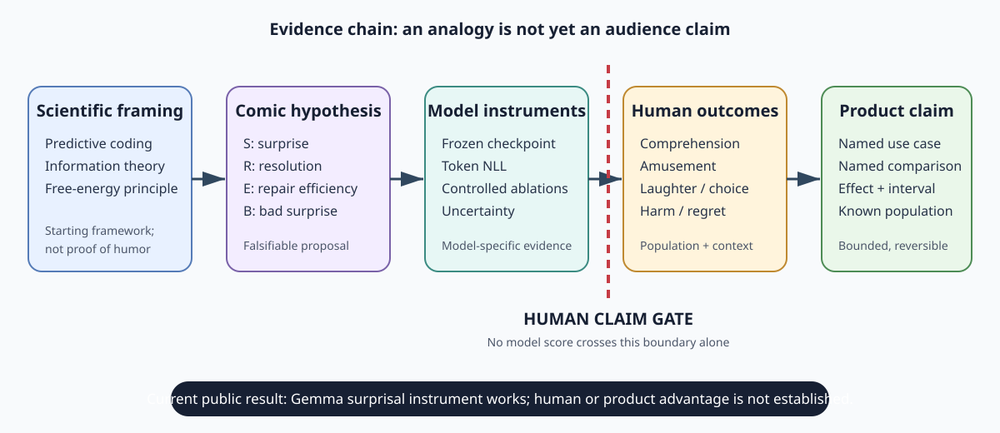

# Humor Genome Wave 2

[](https://github.com/aidonerightcorp/humorvibes-jestry/actions/workflows/app-contracts.yml)

A public, reproducible Gemma study of humor structure. **HumorVibes** is the implementation name;
**Humor Genome Wave 2** is the canonical research release.

The original hackathon deadline has passed and no competition submission is claimed. Version
0.8.0 closes the initial build phase; the repository now continues in a maintained,
community-extensible research state with public results, corrections, limitations, and extension
paths.

**Problem:** humor outcomes depend on material, delivery, audience, culture, and context, while
most datasets and text models observe only a fragment of that system. A model score cannot decide
what a room will find funny. **Exploration:** this project makes multilingual source provenance,
structural forms, Gemma surprise/frame measurements, uncertainty, and corrections reproducible,
then exposes bounded retrieval and generation tools for human-led workflows. **Practical use:** it
can help writers search and draft, researchers design and reproduce studies, educators teach
evidence boundaries, and builders prototype consent-based applications. Human response remains the
claim gate.



## Start here

| Public artifact | Open it | Status | What it is for |
| --- | --- | --- | --- |
| Executable study | [Kaggle notebook](https://www.kaggle.com/code/taylorsamarel/humor-genome-wave-2-reproducible-gemma-study) | Public, v15 COMPLETE | Read the write-up and rerun every public measurement |
| Research data | [Kaggle dataset](https://www.kaggle.com/datasets/taylorsamarel/humor-genome-wave2) | Public v7, ready | Load the rights-filtered corpus, aligned phrases, frames, census, and manifest |
| Source and receipts | [GitHub repository](https://github.com/aidonerightcorp/humorvibes-jestry) | Public | Inspect implementation, tests, immutable source tags, and machine-readable evidence |
| Open causal controls | [Kaggle dataset](https://www.kaggle.com/datasets/taylorsamarel/humor-genome-open-controls) + [executed notebook](https://www.kaggle.com/code/taylorsamarel/humor-genome-open-controls-causal-design-lab) | Dataset v4 ready; notebook v4 COMPLETE | Use 120,000 CC0 procedural controls and frozen easy/hard retrieval tracks without confusing them with human evidence |
| Application release | [GitHub release](https://github.com/aidonerightcorp/humorvibes-jestry/releases/tag/v0.8.0) + [public container](https://github.com/users/aidonerightcorp/packages/container/package/humorvibes-jestry) | Public 0.8.0 closeout; wheel/sdist and two-platform image independently verified | Integrate the bounded SDK/API or deploy the digest-pinned attested image |

The Wave 2 notebook is the canonical executable write-up for the observational study. It clones the immutable
`humor-genome-wave2-v10` source tag, verifies the mounted dataset byte-for-byte and semantically,
loads the attached Gemma 2 checkpoint, and then runs the study. The latest cross-surface receipt is
[`jestry_out/v0_8_0_publication.json`](jestry_out/v0_8_0_publication.json);
[`jestry_out/wave2_publication.json`](jestry_out/wave2_publication.json) scopes the Wave 2 Kaggle
surfaces specifically (its application block predates 0.8.0). Open Controls is a
separate causal-design lab with its own downloadable verification and publication receipt at
[`jestry_out/open_controls_publication.json`](jestry_out/open_controls_publication.json).

## Read, verify, or help

- [`PROJECT_WRITEUP.md`](PROJECT_WRITEUP.md): the polished research narrative and controlling
  findings, written for readers who do not need the implementation history.
- [`PROJECT_STATUS.md`](PROJECT_STATUS.md): what is public and complete, what is not claimed, and
  how to verify the release.
- [`PROJECT_CLOSEOUT.md`](PROJECT_CLOSEOUT.md): the stable handoff, maintenance state, reopen
  conditions, and future-work evidence gates.
- [`CHANGELOG.md`](CHANGELOG.md) and [`RELEASE_NOTES_v0.8.0.md`](RELEASE_NOTES_v0.8.0.md): the
  application release history and the exact 0.8.0 closeout boundary.
- [`CITATION.cff`](CITATION.cff): cite the software release; also cite the exact Kaggle artifact
  version used in an analysis.
- [`docs/THESIS_AND_EVIDENCE.md`](docs/THESIS_AND_EVIDENCE.md): the surprise-reduction thesis
  stated hierarchically — every tenet tied to its instrument, its receipt, and its current status.
  The reconciliation map when THEORY.md and RESEARCH_FOUNDATIONS.md seem to disagree; reading
  order for `docs/` is in [`docs/README.md`](docs/README.md).
- [`docs/DOI_ARCHIVE.md`](docs/DOI_ARCHIVE.md): whole-tag archive checksums, the anonymous DOI
  verifier, current no-DOI status, and the exact owner-account publication gate.
- [`CONTRIBUTING.md`](CONTRIBUTING.md): local setup, evidence rules, tests, and pull-request
  expectations.
- [`ROADMAP.md`](ROADMAP.md): prioritized, contribution-sized research and maintenance work.
- [`docs/EXPANSION_GUIDE.md`](docs/EXPANSION_GUIDE.md): exact paths for adding sources, languages,
  labels, model instruments, experiments, and public releases.
- [`source_spec_preflight.py`](source_spec_preflight.py): offline-first, no-write schema,
  provenance, licence, duplicate, and export-policy gate for one proposed Hugging Face source.
- [`docs/API_AND_DEPLOYMENT.md`](docs/API_AND_DEPLOYMENT.md): Python SDK, FastAPI, Docker,
  Compose, local/cloud Ollama, Kubernetes, authentication, and configuration.
- [`docs/INTEGRATIONS.md`](docs/INTEGRATIONS.md): supported LLM/embedding providers and the
  application contract.
- [`docs/ADVERSARIAL_VALIDATION.md`](docs/ADVERSARIAL_VALIDATION.md): tested attack classes,
  deterministic audit commands, and security boundaries.
- [`docs/NATIVE_LANGUAGE_CONTRIBUTIONS.md`](docs/NATIVE_LANGUAGE_CONTRIBUTIONS.md): one-language
  review bundles, privacy-minimized human attestations, licence gates, fixture counts, and the
  body-free validation receipt.
- [`docs/PRODUCT_AND_RESEARCH_USE_CASES.md`](docs/PRODUCT_AND_RESEARCH_USE_CASES.md): what a
  comedian, audience member, academic, educator, curator, or product team can use now; the missing
  evidence; and the claim gates for stronger conclusions.
- [`docs/RESEARCH_FOUNDATIONS.md`](docs/RESEARCH_FOUNDATIONS.md): the sourced starting point,
  definitions, intellectual lineage, evidence map, falsifiable predictions, and the precise sense
  in which “surprise reduction” is a framework rather than a completed result.
- [`docs/REAL_WORLD_STUDY_WORKBENCH.md`](docs/REAL_WORLD_STUDY_WORKBENCH.md): the executable,
  privacy-minimized writer crossover protocol, claim-threshold-aware precision planner,
  hierarchical power sensitivity, private-keyed
  randomization, blinded launch pack, local analyzer, evidence ladder, and remaining human-study
  infrastructure. The checked-in
  [`study_demo_receipt.json`](jestry_out/study_demo_receipt.json) proves the synthetic positive
  effect remains non-claim-ready; the
  [`launch_receipt.json`](jestry_out/study_launch_example_v1/launch_receipt.json) proves the
  complete precollection pack also remains non-claim-ready.
- [`docs/MULTIMODAL_BENCHMARK.md`](docs/MULTIMODAL_BENCHMARK.md): the rights-safe procedural
  caption-plus-drawing fixture, whole-contest split and image-leakage contract, identical
  text/image/fusion evaluation arms, and the evidence gate for replacing it with human data.
- [`docs/NOTEBOOKS.md`](docs/NOTEBOOKS.md): the canonical notebook, the role of each supporting
  notebook, and the clarity contract for future experiments.
- [`docs/OPEN_CONTROLS.md`](docs/OPEN_CONTROLS.md): the 120,000-row deterministic CC0 control
  corpus, public dataset/notebook, adversarial gates, human/model evidence lanes, API, schemas,
  and release procedure.

Issues, reproductions, and research proposals are welcome. In this project, reproducing a null
result, removing a confound, or documenting a licensing boundary is a successful contribution.
Community expectations and support routes are in [`CODE_OF_CONDUCT.md`](CODE_OF_CONDUCT.md) and
[`SUPPORT.md`](SUPPORT.md).
Repository code and documentation are licensed under Apache-2.0. The new project-controlled Open
Controls payload is separately dedicated under CC0-1.0; imported dataset rows retain their exact
recorded source licences and are not relicensed by the repository licence.

## Use it in an application

The published research notebook remains immutable, while a separate `humorvibes` package exposes
the reusable tooling as an SDK and FastAPI service. Its default profile makes no network calls:
generation is explicitly disabled and embeddings use deterministic `hash:128` token vectors.

```bash
python3 -m venv .venv
source .venv/bin/activate
python3 -m pip install -e ".[api]"
humorvibes doctor
humorvibes adversarial
humorvibes study-demo
humorvibes multimodal-fixture --out-dir /tmp/humorvibes-multimodal --contests 30
humorvibes multimodal-human-contract --out /tmp/human-multimodal-contract.json
humorvibes provider-matrix --spec provider_matrix_live_v1.json --out /tmp/provider-matrix.json
humorvibes-api
```

The first exact live semantic comparison is documented in
[`docs/PROVIDER_MATRIX.md`](docs/PROVIDER_MATRIX.md): five combinations, two independent server
implementations, two frozen tasks, bootstrap intervals, language/failure slices, and no default
recommendation from availability alone.

```bash
curl --fail http://127.0.0.1:8080/health/ready
curl --fail -X POST http://127.0.0.1:8080/v1/similarity \
  -H 'Content-Type: application/json' \
  -d '{"left":["Even experts slip."],"right":["A master can blunder."]}'

curl --fail -X POST http://127.0.0.1:8080/v1/open-controls/sample \
  -H 'Content-Type: application/json' \
  -d '{"count":4,"arm":"surprising_resolved","split":"test"}'
```

Container quick start using the independently verified v0.8.0 digest:

```bash
docker run --rm --read-only --tmpfs /tmp:rw,size=64m \
  --cap-drop ALL --security-opt no-new-privileges:true \
  -p 127.0.0.1:8080:8080 \
  ghcr.io/aidonerightcorp/humorvibes-jestry@sha256:95568eb899c1a3aa51d8dc1a0884212390f9cc4e85c3aa643477a6355673f4e7
```

Or build the current checkout with Compose:

```bash
docker compose up --build --wait
python3 examples/remote_client.py
docker compose down
```

The public wheel/sdist, anonymous container pull, platforms, SPDX/SLSA layers, tag-pinned
attestation, labels, hardened runtime, API, and Kaggle surfaces were independently checked in
[`jestry_out/v0_8_0_publication.json`](jestry_out/v0_8_0_publication.json). The digest overlay is at
[`deploy/overlays/ghcr`](deploy/overlays/ghcr). The unchanged deployment contract was last installed
through Kustomize and Helm in the v0.7.1 disposable `kind` proof: two replicas became ready with
zero restarts and the live Service checks passed. The run, including the service-link collision it
uncovered and the verified cleanup, is recorded in
[`jestry_out/v0_7_1_kind_smoke.json`](jestry_out/v0_7_1_kind_smoke.json). This is local cluster
proof, not a v0.8.0 cluster-apply or hosted-production claim.

To build from the current source and reproduce the static and live-container receipt:

```bash
python3 verify_deployment.py --docker \
  --kustomize-image registry.k8s.io/kubectl:v1.36.2 \
  --helm-image alpine/helm:4.2.0@sha256:af08f75a3130d666a50b9fc150f40987ef20b885cf67659aabf4b83a5f2c5501 \
  --out jestry_out/deployment_validation.json
```

The same API supports authenticated local or cloud Ollama, OpenAI-compatible generation and
embeddings, six configurable Ollama embedding model names, optional sentence-transformers,
body-free OTLP traces, Prometheus/StatsD metrics, and a separately rendered Envoy Gateway edge.
All live model IDs are exact operator allowlists; callers cannot provide arbitrary provider URLs.
See the [deployment guide](docs/API_AND_DEPLOYMENT.md) for Ollama keys, model configuration,
Docker profiles, the non-root Kubernetes base, the Helm chart, typed remote client, and checked-in
OpenAPI contract.

## Release at a glance

- **3,164,600 rows** in the full local research inventory, spanning 217 source families and 62
  language labels.
- **121,670 rows** in the public, deterministic, rights-filtered slice; 2,693,272 rows remain in
  the census but are not republished verbatim.
- **7,913 aligned translation pairs** and **2,581 expectation/violation annotation rows**
  (covering 705 annotated cartoons, ≈3.7 annotation rows per cartoon).
- **120,000 separate CC0 procedural controls** in four matched arms; no human-authored or
  human-rated rows.
- Gemma instrument check: **S = 3.188 over 10 tokens** against the pinned 3.19 reference.
- Full form study: **0/10** joke-form intervals strictly above the proverb control and 10/10
  overlapping it — **SEPARATION IS NOT ESTABLISHED**.
- Contest-held-out caption model: Spearman **0.1555**, or **37.8%** of the measured text-only bound.
- Cross-corpus transfer: the strongest structural model (within-Humicroedit **0.5075**) scores
  **−0.0091** on a different joke population — the 0.51 describes Humicroedit, not humor. Exactly
  one of 30 features (`punch_rarity_max`, ρ ≈ −0.05…−0.09, *negative*) survives sign+FDR in all
  three corpora.
- Post-closeout wave 1 (2026-07-27): declared-style surprisal replicates the form-study null
  (**0/7** community-labeled styles separate from the proverb control, permutation p = 0.45);
  caption divisiveness is a real label (reliability 0.51) but no more text-predictable than the
  mean; word-level demographic humor gaps are mostly noise (9/4,997 sex, 0/4,997 age survive FDR).
  Tenet-by-tenet status: [`docs/THESIS_AND_EVIDENCE.md`](docs/THESIS_AND_EVIDENCE.md).

`S` is model surprisal, not funniness. The dataset mixes jokes, captions, proverbs, idioms, and
other humor-adjacent text; source-specific human signals are not interchangeable grades.

Mini-glossary for first-time readers: **S/R/E/B** = measured surprise, resolution (surprisal drop
under the true frame), efficiency (resolution per repair token), and persona-relative bad
surprise; **mesh** = the predictive-network framing in `THEORY.md`; **laugh region** = the
receipted S/R/E acceptance band of the certified instrument; **Jestry** = the governed
reuse-before-generation layer (18-law charter); **been-done** = dual-channel precedent search
(surface wording + comic frame); **groaner** = a measured-then-rejected outcome retained in the
ledger.

## How the public artifacts fit together

| Layer | Contract |
| --- | --- |
| Wave 2 dataset | Publishes only explicitly redistributable observed text, plus a full-corpus census and hashes |
| Wave 2 notebook | Verifies those files, runs Gemma, and displays the controlling observational receipts |
| Open Controls dataset | Publishes deterministic matched alternatives, grouped splits, qrels, schemas, and audit receipts under CC0 |
| Open Controls notebook | Verifies all mounted bytes and runs artifact and retrieval baselines without upgrading them to human evidence |
| Repository | Builds both artifacts and preserves code, tests, provenance, negative results, and publication receipts |

## Canonical repository map

- `PROJECT_STATUS.md`, `PROJECT_WRITEUP.md`, `CONTRIBUTING.md`, `ROADMAP.md`: the current public
  project entry points. Deadline-era submission packets are retained only as historical records.
- `docs/EXPANSION_GUIDE.md`: the maintainer and contributor playbook for extending each research
  layer without bypassing provenance or verification.
- `wave2_notebook/`: the one notebook to read and publish; older notebook directories are
  supporting experiments, not competing entry points.
- `humorvibes/`, `Dockerfile`, `compose*.yaml`, `deploy/kubernetes/`, `deploy/helm/`: the SDK/API
  and deployment surface; it is an extension layer, not a second research notebook.
- `build_kaggle_export.py`, `wave2_dataset/`, `verify_wave2_release.py`: public dataset build,
  Kaggle metadata, and fail-closed validation.
- `build_open_controls.py`, `verify_open_controls_release.py`, `open_controls_dataset/`, and
  `open_controls_notebook/`: separate CC0 procedural-control build, semantic verifier, public
  dataset descriptor, and executable causal-design notebook.
- `caption_*.py`, `style_taxonomy.py`, `corpus_census.py`: the measured Wave 2 analyses.
- `jestry_out/`: compact, versioned receipts; `v0_8_0_publication.json` is the latest release
  index, `wave2_publication.json` the Wave 2 Kaggle-surface index.
- `RESULTS.md`, `STYLES.md`, `DATA_SOURCES.md`: detailed findings, taxonomy, and source provenance.
- `research_out/` and the other notebook folders: historical/supporting experiments retained for
  auditability. They are not required to understand the canonical release.

## Reproduce the public release

```bash
git clone https://github.com/aidonerightcorp/humorvibes-jestry.git
cd humorvibes-jestry
python3 -m venv .venv
source .venv/bin/activate
python3 -m pip install -r requirements-dev.txt
python3 -m pytest -q tests/test_wave2.py
python3 wave2_notebook/build_wave2_notebook.py

kaggle datasets download -d taylorsamarel/humor-genome-wave2 \
  --unzip -p kaggle_wave2_public
python3 verify_wave2_release.py --root kaggle_wave2_public
```

Verify the separate Open Controls release without access to the private research inventory:

```bash
kaggle datasets download -d taylorsamarel/humor-genome-open-controls \
  --unzip -p kaggle_open_controls_public
python3 verify_open_controls_release.py --root kaggle_open_controls_public
kaggle kernels status taylorsamarel/humor-genome-open-controls-causal-design-lab
```

## Project background and additional systems

The repository began as a broader Gemma-powered humor engine for the Build with Gemma: Humor
Genome NYC hackathon. It was formerly called "Punchline Mesh", so a few historical Kaggle slugs
retain that name for stability.

The theory is developed in `THEORY.md`, a derivative of Karl Friston's "Your Brain Is a Detective
Minimizing Surprise" framing and the wider predictive-processing literature. “The brain is a
surprise-reduction engine” is the project's motivating shorthand, not a settled biological claim.
The project hypothesizes that a joke can be a controlled prediction error with a compact,
audience-permitted repair: surprising (S), resolvable through a hidden frame (R), affordable (E),
and low in audience-relative bad surprise (B). Gemma is an instrument here, not an oracle. The
public notebook has pinned `S`; `R/E/B` remain proposed constructs requiring ablations and human
validation. See the [sourced foundation](docs/RESEARCH_FOUNDATIONS.md) for the evidence map and
primary references.

The prototype implements one loop:

1. Generate candidates (divergent sampling; per-format contracts in `formats.py`).
2. Retrieve relevant humor data sources and nearby calibrated examples.
3. **Measure** each candidate: S/R/E off Gemma logits, persona-conditioned B (`mesh_signals.py`).
4. Score across the qualitative humor mesh; plan audience/study experiments; rank mechanisms.
5. Compare candidates with pairwise/tournament ranking and the multi-LLM panel (`llm_panel.py`).
6. Explain which of the theory's four failure modes applies (predictable / no re-route /
   too expensive / bad surprise).
7. Repair the diagnosed failure while preserving the comic turn.
8. **Compile** validated material into deterministic artifacts (`compiled_humor.py`):
   joke programs (seeded slots, zero model calls at runtime) and clip render plans
   (HOOK/BUILD/SNAP timelines for ffmpeg/moviepy) — the Compiled-AI paradigm applied to comedy;
   auditable before performance and stage-safe only after its lint/probe gates pass. The verified
   demonstration intentionally remains `validated: False` because those gates rejected it.

## Canonical bad-surprise definition

Bad surprise is poorly defined, a bad surprise is a surprise that contradicts with internal models within a human brain that are so strong they override logic and are some of the primary drivers of a person's perception, understanding, and good/bad/moral/ethical views of the world. So basically, a surprise is not good if it disagrees with something that is already overriding logic or a surprise is not good it if disagrees with a nearly overwhelming generalization engine in a human mind that has significant overriding power to override logic, promote other false generalizations, and is the primary feature used to reduce surprise in that person's mind.

HumorVibes treats that definition as a first-class evaluation constraint, not as a synonym for offense, randomness, factual error, or incoherence.

## Additional prototype tools

Offline deterministic demo:

```bash
python3 cli_demo.py
```

Inspect the humor datacenter registry and seeded retrieval layer:

```bash
python3 datacenter_cli.py sources
python3 datacenter_cli.py branches
python3 datacenter_cli.py mechanisms
python3 datacenter_cli.py probes
python3 datacenter_cli.py rank-branches "political joke for a mixed audience" --preferences "bridge, not partisan"
python3 datacenter_cli.py rank-mechanisms "AI project managers for a NYC tech meetup" --audience "NYC tech meetup"
python3 datacenter_cli.py rank-probes "political joke for a mixed audience" --preferences "bridge, not partisan"
python3 datacenter_cli.py rank-sources "AI project managers for a NYC tech meetup" --audience "NYC tech meetup"
python3 datacenter_cli.py demo-search "AI project managers for a NYC tech meetup"
python3 datacenter_cli.py context "AI project managers for a NYC tech meetup" --audience "NYC tech meetup" --laughter-seconds 3 --applause 4
python3 datacenter_cli.py demo-lessons
python3 datacenter_cli.py plan-experiments "political joke for a mixed audience" --preferences "bridge, not partisan"
python3 datacenter_cli.py recommend-mechanisms "AI project managers for a NYC tech meetup" --audience "NYC tech meetup"
python3 datacenter_cli.py portability-check "Congress found a bipartisan solution: both sides agreed the printer was the real problem." --audience "mixed political audience" --preferences "bridge"
python3 datacenter_cli.py acquisition-plan "moral frame pairwise ranking for cross ideology political humor" --audience "mixed political audience" --preferences "bridge, dominant models"
python3 datacenter_cli.py market-gaps --audience "tech meetups and corporate teams" --preferences "AI, clean, smart, local"
python3 datacenter_cli.py style-shift-risk --current "clean observational corporate humor" --proposed "political aggressive dark crowdwork" --audience-lock-in 8 --bridge-overlap 2
python3 datacenter_cli.py model-judges
python3 datacenter_cli.py demo-model-convergence
python3 datacenter_cli.py model-jury-prompt --candidate "The AI project manager found the bottleneck: the calendar wanted attention." --audience "NYC tech meetup" --preferences "smart, not mean"
python3 datacenter_cli.py demo-tournament
```

Streamlit UI:

```bash
python3 -m streamlit run app.py
```

Gemma through Ollama:

```bash
export GEMMA_PROVIDER=ollama
export GEMMA_MODEL=gemma3:4b
python3 -m streamlit run app.py
```

## Measured-signal CLI (new layer)

```bash
python3 mesh_cli.py formats
python3 mesh_cli.py signals --text "I told my therapist about my fear of speed bumps. She said I'm slowly getting over it." --personas "NYC tech meetup,retired farmers"
python3 mesh_cli.py generate --topic "AI project managers" --format meme_caption --audience "NYC tech meetup"
python3 mesh_cli.py critique --text "HOOK: my landlord says the heat is on ... SNAP: it was a scented candle" --format shorts_script
python3 mesh_cli.py panel --text "..." --personas "improv crowd,corporate offsite"   # frontier-LLM judges, keys-gated
python3 mesh_cli.py compile --topic "meetings" --format one_liner --audience "office workers"
python3 mesh_cli.py run-compiled --artifact compiled_artifacts/<id>.json --seed 7
python3 mesh_cli.py compile-clip --script "HOOK: ... [desk] BUILD: ... [zoom] SNAP: ... [freeze]"
```

Provider selection: `GEMMA_PROVIDER=offline|ollama|transformers` (offline is the default; the
transformers provider auto-selects only inside Kaggle). The Kaggle demo notebook
(`build_notebook.py` → `notebook.ipynb`) runs everything against real Gemma logits. Its latest
pinned output is the verified CPU-fallback run; CUDA is used only when the notebook's probe passes:
https://www.kaggle.com/code/taylorsamarel/humorvibes-measuring-jokes-with-gemma (a **private**
kernel — the URL is recorded for provenance and resolves only for the maintainer).

Reproducibility state (2026-07-12): an authenticated read-only audit re-pulled all six private
Kaggle kernels. All were COMPLETE; normalized source cells matched the local builders and every
mirrored research output matched byte-for-byte. See `research_out/kernel_audit_20260712.md`.
The seventh private kernel, `humorvibes-ablation-court` v4, subsequently completed and passed its
separate source/hash/privacy harvest gate: 200/200 Gemma measurements, fixed S/R/E/B rho=0.033
(95% CI [-0.126, 0.207]), an honest negative result. See
`research_out/kaggle/humorvibes-ablation-court/ABLATION_REPORT.md`. This verification does not make
any notebook public and is not a competition submission.

## Wave 2 corpus and Gemma study (2026-07-26)

Wave 2 turns the source sweep into a reproducible release rather than a directory-sized claim:

- **3,164,600** full-corpus rows across 217 source families and 62 language labels;
- **121,670** redistributable rows in the deterministic, per-family-capped Kaggle slice, selected
  from 471,328 eligible records after a deny-first rights gate;
- **7,913** non-English phrases carrying English counterparts and **2,581** independently
  annotated expectation/violation frames;
- per-record provenance and licence, a full-corpus census, and SHA-256/byte manifests verified by
  the consuming notebook before it measures anything.

The published sample is deliberately stratified and rights-filtered. The caption family is 71.0%
of the full corpus; a random sample would reproduce that imbalance, while the deny-first licence
gate and 12,000-row family cap reduce captions to 2.2% of the public slice and hold every source
family below 9.9%. Selection is SHA-256 ordered and clock-free, so rebuilding the same corpus
yields identical bytes. The other 2,693,272 records remain represented in the local census but
their verbatim text is not published because their licence class is noncommercial, research-only,
or unclassified.

The Gemma-2 form study reports uncertainty, not a winner: all ten joke-form bootstrap intervals
overlap the proverb control, so the checked-in notebook prints **SEPARATION IS NOT ESTABLISHED**.
Its S statistic is model surprisal, not a human funniness grade.

The human-label arm is contest-held-out rather than row-random: 30 structural text features reach
median Spearman **0.1555** on 215,465 captions across 360 unseen drawings, or **37.8% of the
measured text-only bound**. The canonical notebook cross-checks that receipt against the independent
label-ceiling and cross-drawing portability receipts before displaying it.

```bash
python3 harvest_wave2.py list
python3 style_taxonomy.py selftest
python3 build_kaggle_export.py --per-family 12000
python3 verify_wave2_release.py
python3 -m pytest -q tests/test_wave2.py
python3 wave2_notebook/build_wave2_notebook.py
```

Dataset: https://www.kaggle.com/datasets/taylorsamarel/humor-genome-wave2
Notebook: https://www.kaggle.com/code/taylorsamarel/humor-genome-wave-2-reproducible-gemma-study

## Files

- `THEORY.md`: the canonical theory (Friston-derived mesh framing → computable S/R/E/B signals).
- `mesh_signals.py`: measured surprise/resolution/efficiency/bad-surprise from Gemma logits.
- `formats.py`: short-form media format presets (timing envelopes) for generation + critique.
- `compiled_humor.py`: Compiled-AI pipeline — validation-gated deterministic joke programs and
  clip plans.
- `llm_panel.py`: multi-LLM audience panel (frontier + local judges, keys-gated, convergence report).
- `live_set_controller.py`: laughter-driven live set — WAV audit-clip laughter scoring (3–6 Hz
  burst envelope), per-frame Thompson-sampling over frozen artifacts, auditable JSONL show logs
  (`mesh_cli.py live`).
- `mesh_cli.py`: unified CLI over all of the above.
- `build_notebook.py` / `notebook.ipynb` / `kernel-metadata.json`: Kaggle Gemma demo notebook;
  its verified run used the explicit CPU fallback after the CUDA probe failed.
- `app.py`: Streamlit interface.
- `cli_demo.py`: no-browser demo.
- `gemma_client.py`: provider adapter for deterministic offline, Ollama, and Transformers paths;
  deterministic offline is the local default.
- `humor_mesh.py`: schema, canonical definition, fallback evaluator.
- `humor_datacenter/`: study branches, audience probes, comedy mechanisms, source registry, acquisition planning, market analytics, model-jury convergence, portability checks, pairwise ranking, experiment planning, audience adaptation, experiment logging, schema, embeddings, SQLite store, and demo retrieval.
- `comedy_primitives_dataset.py` → `dataset_out/`: the humor genome as a portable dataset.
  Comedy mechanisms and format specs as structured primitives, every indexed item with its
  source/license/language, the Gemma-labeled frame subset, rows carrying real teacher-forced
  S/R/E, and **dual-channel 768-dim embeddings** (surface wording and comic frame embedded
  separately, which is what makes cross-lingual same-engine retrieval work). Ships a dataset
  card and a manifest of sha256 digests; the `.npy` matrices are git-ignored and rebuilt by
  rerunning the exporter. Verified by gate G13 (row counts, license coverage, matrix alignment).
- `browser_test_portal.py`: real headless-Chrome acceptance test of the portal over the DevTools
  protocol. Every tab clicked and screenshotted, JS exceptions and failed requests captured,
  rendered numbers cross-checked against the API, phone viewport checked for overflow.
  Receipt: `jestry_out/browser_test_portal.json`.
- `canonicalize_format.py`, `native_format_probe.py`, `instrument_quant_check.py`: the
  format-boundary experiment, its native-format follow-up, and the quantization-robustness probe.
  Findings are written up in `RESEARCH_NOTE_INSTRUMENT_BOUNDARIES.md`.
- `DATA_SOURCES.md`: scanned source matrix and acquisition notes.
- `SOURCE_SWEEP_2026-07-26.md`: live source inventory, dead-source ledger, parser repairs, and
  licensing limits for Wave 2.
- `harvest_wave2.py` / `wave2_specs.json`: checkpointed, exact-deduped API/Wikimedia/HuggingFace
  acquisition; bulk HuggingFace reads use resumable Parquet transport with row-API fallback.
- `style_taxonomy.py` / `STYLES.md`: structural form, lexical domain, and source-declared style
  axes, including language-specific forms and the documented length-proxy confound.
- `corpus_census.py` / `build_kaggle_export.py`: one-pass census and bounded-memory deterministic
  release builder; release reads fail closed on malformed JSON.
- `caption_corpus.py` / `caption_ceiling.py` / `caption_portability.py` / `caption_model.py`:
  integrity-clean caption loading, two-estimator label ceiling, cross-drawing text-only bound, and
  contest-held-out structural model. Compact measured receipts live under `jestry_out/`.
- `verify_wave2_release.py` / `verify_jestry.py`: semantic release checks and 16 cross-receipt gates.
- `wave2_notebook/`: deterministic notebook builder, checked-in notebook, and Kaggle metadata.
- `RESEARCH_ROADMAP.md`: historical prototype-era backlog (hackathon closed); current priorities live in `ROADMAP.md`.
- `JUDGE_EVIDENCE.md`: claim-by-claim receipt map, negative results, and private/public gates.
- `ablation_lab/`: source-pinned private ablation kernel builder, tests, and receipt-gated
  harvester; versions 1–3 are excluded from evidence and only the harvested v4 result counts.
- `research_out/kaggle/humorvibes-ablation-court/`: 200-row S/R/E/B ablation, paired controls,
  failure table/figure, model/data/runtime receipts, and compact judge-facing report.
- `demo_assets/humorvibes_studio_20260712.png`: current branded studio screenshot. It visibly
  discloses the offline deterministic provider and is not presented as Gemma measurement evidence.
- `prompts/`: structured Gemma prompts.
- `examples/`: demo inputs.

## Jestry — the verified laugh-reuse layer (2026-07-23, additive)

A constitution-governed reuse/construction layer over everything above, built with
Gemma 4 (Ollama `gemma4`) + embeddinggemma. Charter (18 laws, machine-encoded and
test-pinned): `JESTRY-CHARTER-AND-CONSTITUTION-2026-07-23.md`. Writeup:
`JESTRY_WRITEUP.md`. Nothing in the pinned evidence above is modified — the
harvested-ablation source-hash tests stay green.

```bash
python3 jestry_cli.py charter                  # the 18 laws, funnel, acceptance levels
python3 jestry_cli.py cards                    # honest registry census (kind-separated)
python3 jestry_cli.py run "Make a joke about AI project managers" \
    --audience "NYC tech meetup" --personas "NYC tech meetup" --format one_liner
python3 -c "from precedent import PrecedentIndex; i=PrecedentIndex(); i.ensure_embedded(); \
print(i.been_done('Man plans and God laughs.').verdict)"   # been-done? (embeddinggemma)
python3 harvest_supply.py keyless --limit 20   # grow supply w/ provenance + dedupe receipts
python3 calibrate_gemma4.py                    # instrument certification (currently: honest FAIL)
python3 jestry_portal.py                       # stdlib live portal on :8081
python3 verify_jestry.py                       # 16 receipt gates; unavailable live checks skip honestly
```

- `jestry.py` — routes ladder (replay → remix → compose-residual → frontier → abstain),
  hard `HumorPolicy` gates, nine-stage contribution-funnel receipts
  (`jestry_out/receipts.jsonl`), groaner ledger, governed laughter bandit.
- `gemma4_nll.py` — forced-NLL S/R/E via Ollama top-K logprobs; copy-attractor
  finding + `certified: false` calibration receipt (`jestry_out/gemma4_calibration.json`):
  uncertified instruments can measure and diagnose but never mint acceptance
  (`RouteProfile.require_certified`); the certified path is `gemma2_full_nll.py`.
- `precedent.py` — "has this joke been done?" at surface + frame level, multilingual
  canon (`corpora/proverbs_multilingual.jsonl`), Gemma 4 labeling lane.
- `harvest_supply.py` — licensing-clean supply growth (ingest lanes + 3 keyless joke
  APIs + stamped synthetic lane + Claude-authored canon lane), receipted; API lanes
  are precedent-deduped on fetch (the authored canon lane predates its own entries).
- `live_portal/` — Kaggle kernel that tunnels the portal via trycloudflare
  (same recipe as the studio kernel; new slug `humorvibes-jestry-portal`).
- `competition/` — hostable "Humor Vibes Open" community-competition pack: design doc,
  dependency-free AUC metric, deterministic data builder (built on the ablation
  court's format-boundary lesson: explicit setup/punchline items only).

## Demo script

Prompt: "Make a joke about AI project managers for a NYC tech meetup. Keep it smart, not mean."

Show:

- With a Gemma provider selected, Gemma generates three candidates; the deterministic offline
  demo exercises the same workflow but is never presented as Gemma evidence.
- The mesh scores structure, audience fit, timing, surprise, cultural context, preference fit, truth alignment, and bad-surprise risk.
- The datacenter panel shows relevant source families and nearby calibrated examples.
- The audience probe/live response panel changes semantic, wording, and delivery directives for the next candidate.
- Political diversity and cross-ideology bridge controls test whether a joke can travel across political identities.
- Experiment planning suggests which study to run next, which probes to ask, and which mechanisms to explore or exploit.
- Market analytics estimates underserved humor niches and style-shift risk for established audiences.
- Model-jury convergence shows where independent model judges agree or disagree before trusting a score.
- Pairwise tournament ranking compares multiple candidates when scalar mesh scores disagree.
- The app selects the strongest candidate.
- The repair step preserves the comic turn while reducing bad-surprise risk for the audience.
