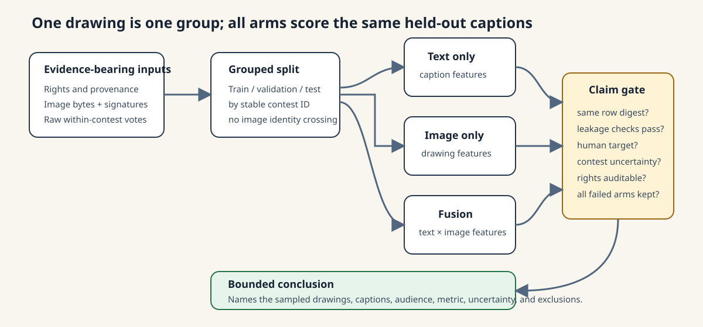

# Multimodal caption benchmark

*Role: the rights-safe caption+drawing experiment contract (issue #4). Audience: anyone proposing a multimodal arm. The checked-in run is a procedural positive control, not a result.*

## Executive summary

Humor in a caption contest is a relation between words, a drawing, and an audience. A text-only
model cannot observe the drawing, and a random row split can leak the same drawing into training
and evaluation. This project now ships the complete experiment contract needed to avoid both
errors: whole-contest splits, rights metadata, exact and canonical-scene image hashes, identical
held-out rows for text-only/image-only/fusion arms, contest-level uncertainty, calibration, error
slices, and a machine-readable claim gate.

The checked-in run uses 30 project-generated SVG scenes and 600 deterministic synthetic captions.
It is a software and leakage test, not evidence that fusion improves humor prediction. There are
zero human captions, zero human ratings, and zero copyrighted cartoon drawings in the fixture.



## The problem this contract solves

A valid caption-plus-drawing comparison has to hold five things constant:

1. Every caption from one drawing belongs to exactly one train, validation, or test group.
2. Exact or canonically equivalent images cannot cross groups.
3. Text-only, image-only, and fusion systems must score the same held-out caption IDs.
4. The primary metric must compare captions within their own contest before aggregating contests.
5. Synthetic labels, model scores, and human judgments must remain separate evidence classes.

[`humorvibes/multimodal_benchmark.py`](../humorvibes/multimodal_benchmark.py) enforces those
conditions. It also reports five-bin calibration and error slices by caption strategy, synthetic
vote-count band, and repeated-caption status.

## Reproduce the rights-safe contract

The command below creates all SVGs, feature rows, hashes, grouped splits, and the final benchmark
receipt. It needs no network, model download, or proprietary data.

```bash
humorvibes multimodal-fixture \
  --out-dir jestry_out/multimodal_contract_v1 \
  --contests 30 \
  --force

humorvibes multimodal-benchmark \
  --root jestry_out/multimodal_contract_v1 \
  --out /tmp/multimodal-recheck.json
```

The committed example has 30 unique image hashes, 30 unique canonical scene signatures, 480
training rows, 60 validation rows, and 60 held-out test rows. All three arms share the held-out row
digest `f27ed4c97de1766046a88e33ed9ec36234ef1bd5a796d9b9f9ec9f860fb0218c`.

Its fusion arm scores higher than the text arm because the synthetic target was deliberately
constructed from text-by-scene interactions. That is a positive-control expectation and proves
the pipeline can recover its own known signal. It must not be quoted as a result about human
humor, model quality, or real drawings. The image-only arm has zero within-contest rank
correlation by construction: one fixed image cannot rank captions against itself.

## Replace the fixture with a real, rights-cleared study

Keep the file and receipt contracts, then replace only the evidence-bearing inputs:

- obtain drawing redistribution or research-use rights and record one licence/provenance row per
  image;
- hash the original image bytes and compute a reviewed near-duplicate signature before splitting;
- group every submission, vote, and image derivative by the stable contest ID;
- freeze the contests and primary metric before fitting any arm;
- derive the target from raw within-contest human votes, retaining vote counts and disagreement;
- generate text, image, and fusion features from declared model/version/dimension combinations;
- fit each arm on the same training contests and score the exact same held-out caption IDs;
- preserve failed arms, repeated captions, missing images, opt-outs, and exclusions in the receipt.

The existing caption analysis measured a real within-contest label ceiling of 0.8262 and an
estimated text portability bound of 0.4110. A real multimodal study should report every arm against
the label ceiling. The 0.4110 bound belongs only to the text-only arm; applying it to image or
fusion arms would be a category error. Neither real-data bound applies to the synthetic fixture.

## Acceptance gate for a real conclusion

A real run is still non-claim-ready until all of these are true:

- the image rights and source snapshot can be independently audited;
- whole-contest and image-identity leakage checks pass;
- the target is human-observed and its uncertainty is reported;
- model and feature provenance is exact, including preprocessing and dimensions;
- contest-level confidence intervals and predeclared error slices are complete;
- the run is reproduced from downloaded public or access-controlled research bytes;
- the receipt says exactly which population, drawings, and audience the conclusion covers.

Until then, the defensible claim is narrower: the project has a fully executable multimodal study
contract and a rights-safe positive-control fixture.

## Human-cohort preflight and evaluator

The repository now has a second, deliberately stricter lane for real observations. It does not
turn an internet download into a rights-cleared benchmark. It requires the evidence that a
reviewer would otherwise have to reconstruct after the analysis:

```bash
python3 -m pip install -e '.[multimodal]'
humorvibes multimodal-human-contract --out /tmp/human-mm-contract.json
humorvibes multimodal-human-validate \
  --root /secure/path/to/frozen-cohort \
  --out /tmp/human-mm-preflight.json
humorvibes multimodal-human-benchmark \
  --root /secure/path/to/frozen-cohort \
  --out /tmp/human-mm-benchmark.json
```

The frozen cohort directory contains `human_multimodal_manifest.json`,
`caption_candidates.jsonl`, `rights_ledger.jsonl`, local image bytes, and local evidence files.
The validator checks all of the following before fitting a model:

- one rights-ledger row per image plus a reviewed caption-cohort licence;
- redistribution, research, and derivative rights stated separately;
- local evidence, source-snapshot, and image SHA-256 digests;
- a recomputed 64-bit difference hash for every decodable image;
- no exact duplicates, near-duplicate split crossings, or canonical-scene split crossings;
- at least two whole contests in each split and the frozen caption minimum in every contest;
- human-observed targets, rating counts, standard errors, protocol evidence, and consent evidence;
- no direct participant identity fields in analysis rows;
- executed feature provenance and stable dimensions for text, image, and fusion arms;
- one content digest over the images, captions, and rights ledger.

The benchmark then uses exactly the same held-out row IDs for all three arms and produces
contest-bootstrap uncertainty, calibration, and the predeclared slices. The output remains
`EXTERNAL_EVIDENCE_REVIEW_REQUIRED`: software can verify bytes and consistency, but cannot prove
that a signer is human, that consent was valid, or that a licence is legally sufficient.

### Why the first plausible public dataset was not silently imported

[HumorDB](https://github.com/kreimanlab/HumorDB) is a useful adjacent, image-only benchmark with
human ratings, and its paper and repository declare CC BY 4.0. Its own data-source notes also say
that images came from mixed internet sources and that non-open-source images are linked to their
origins. That dataset-level declaration is not the source-level permission required for this
caption-plus-drawing cohort. It also does not offer multiple competing captions per fixed drawing,
so it cannot answer the same-contest text-versus-image-versus-fusion question. The project records
that as a rejected import, not as a completed human benchmark.

### The remaining external collection step

The shortest clean route is a small, preregistered cohort made from project-created or
commissioned drawings. Obtain an explicit redistributable caption licence during submission,
collect independent audience ratings, freeze whole contests, then run the two commands above.
Publish only privacy-minimized aggregates and the exact evidence files approved for release.
The rights-cleared human cohort this contract awaits is issue
[#4](https://github.com/aidonerightcorp/humorvibes-jestry/issues/4).
