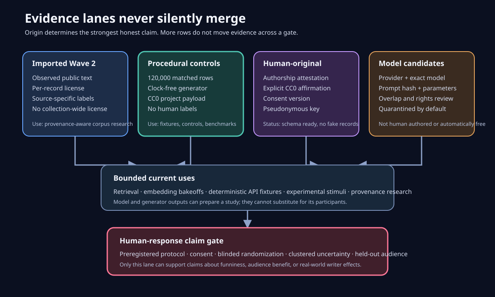

# Humor Genome Open Controls

Open Controls is a separate, deterministic, project-controlled corpus for experiments that the
observational Wave 2 corpus cannot support. It is deliberately synthetic and deliberately narrow.



## Public release

| Artifact | Public location | Verified state |
| --- | --- | --- |
| Dataset | [Humor Genome Open Controls](https://www.kaggle.com/datasets/taylorsamarel/humor-genome-open-controls) | Kaggle version 4, ready; fresh download passed all 14 release checks |
| Executed analysis | [Open Controls Causal Design Lab](https://www.kaggle.com/code/taylorsamarel/humor-genome-open-controls-causal-design-lab) | Kaggle version 3, COMPLETE; 24 manifested files verified |
| Source | [`humor-genome-open-controls-v2`](https://github.com/aidonerightcorp/humorvibes-jestry/tree/humor-genome-open-controls-v2) | Immutable generator, verifier, notebook, API, tests, and publication receipt |

Kaggle version numbers include publication retries; the semantic corpus release is v1. The
machine-readable cross-surface evidence is
[`jestry_out/open_controls_publication.json`](../jestry_out/open_controls_publication.json).

## Problem and proposed solution

Most humor corpora contain only the final text. A researcher cannot tell whether a response came
from surprise, a coherent reinterpretation, familiarity, delivery, audience context, or source
selection. Randomly scraping more jokes increases volume without creating the counterfactual that
the theory needs.

Open Controls holds the premise and configuration fixed while changing the continuation:

| Arm | Construction | Intended diagnostic |
| --- | --- | --- |
| `expected_literal` | Ordinary continuation | Baseline expectation |
| `surprising_unresolved` | Unexpected but disconnected continuation | Surprise without repair |
| `surprising_resolved` | Compact lexical reframe | Surprise with affordable repair |
| `resolved_overexplained` | Both word senses stated explicitly | Repair with explanation cost |

This implements `expectation -> violation -> optional repair` as a dataset design. It does not
show that a person experiences those stages, that a resolved row is funny, or that a model score
is a brain measure.

## Release scale

The complete semantic v1 release contains:

```text
300 premise families
x 50 controlled configurations
x 4 counterfactual arms
x 2 surface variants
= 120,000 rows
```

The 300 premise families combine 30 lexical-frame templates with 10 situations. That composition
is explicit because row count is not independence: the strongest distinct unit is the template
family, not an individual generated sentence. Templates are isolated across train, validation,
and test. Random row splitting is invalid for this corpus.

## Reproduce from source

Create an environment containing the development dependencies, build, then verify independently:

```bash
python3 -m venv .venv
source .venv/bin/activate
python3 -m pip install -r requirements-dev.txt

python3 build_open_controls.py --reference-dir corpora
python3 verify_open_controls_release.py --root kaggle_open_controls
```

The build is clock-free. Selection, item IDs, splits, unresolved continuations, and file order are
derived from the declared seed and source. The builder emits JSONL and Parquet, strict schemas,
retrieval qrels, audit receipts, source provenance, licensing, and SHA-256/byte manifests.
`release-metadata.json` preserves the public dataset identity and discovery metadata inside the
downloadable manifest. Kaggle consumes its reserved `dataset-metadata.json` upload-control file,
so the verifier deliberately does not require that reserved file after download.

For a small network-free inspection through the installed package:

```bash
humorvibes controls-info
humorvibes controls-sample --count 8 --arm surprising_resolved --split test
```

The same operations are available over the authenticated API:

```bash
curl --fail http://127.0.0.1:8080/v1/open-controls/metadata
curl --fail -X POST http://127.0.0.1:8080/v1/open-controls/sample \
  -H 'Content-Type: application/json' \
  -d '{"count":8,"arm":"surprising_resolved","split":"test"}'
```

These endpoints generate bounded procedural fixtures from packaged source; they do not call an
LLM, access the published dataset, or return human observations.

## Adversarial validation

The release fails closed on:

- missing or extra schema fields;
- duplicate item IDs or normalized text;
- unbalanced arms or surface variants;
- premise or template leakage across splits;
- any row labeled as human-authored, human-rated, or human-funny;
- a non-CC0 row in the procedural payload;
- multiple generator source hashes in one build;
- URLs, handles, or named social platforms in generated text;
- a coarse surface-only arm adversary reaching 80% accuracy;
- exact or shared 12-word overlap between one prototype per premise/arm and the existing local
  corpus inventory.

The surface adversary uses word-count, character-count, sentence-count, comma-count, and
colon-count bins. It is a useful artifact screen, not a semantic classifier. Its measured accuracy
must be reported even when the release passes. The reference scan does not guarantee worldwide
originality and does not replace trademark, privacy, or cultural review.

## Embedding and retrieval use

The release includes one query, one compact-resolution document, and one qrel per premise family.
The public notebook evaluates a TF-IDF baseline by split. To compare another embedding model:

1. Read `retrieval_documents.jsonl` and `retrieval_queries.jsonl` without reordering them.
2. Embed each side with an exact model/version and record dimensions and normalization.
3. Compute cosine similarity or the model's documented metric.
4. Evaluate against `retrieval_qrels.jsonl` separately for train, validation, and test.
5. Report MRR, Recall@1, Recall@10, runtime, and the complete provider configuration.

The application supports deterministic hash embeddings, an operator allowlist of Ollama embedding
models, OpenAI-compatible embedding endpoints, and optional sentence-transformers. Similarity is
not proof of novelty, equivalence, funniness, or audience suitability.

The original query repeats the controlled entity and setting, so it is a pipeline baseline rather
than a demanding semantic test. Build and evaluate the harder track with:

```bash
humorvibes retrieval-hard-build \
  --release-root kaggle_open_controls \
  --out-dir hard_retrieval_v1
humorvibes retrieval-benchmark --root hard_retrieval_v1 --model lexical:tfidf
humorvibes retrieval-benchmark --root hard_retrieval_v1 --model hash:128
humorvibes retrieval-benchmark --root hard_retrieval_v1 --model ollama:embeddinggemma
```

The hard query removes the entity and both pivot words, describes their senses and situation
indirectly, and records two within-split negatives: the same frame in a different context and the
same context with a different frame. Template families remain isolated across train, validation,
and test. Any configured embedding model can use the same evaluator; its exact allowlisted model
ID, dimensions, normalization, benchmark digest, MRR, Recall@k, median rank, and hard-negative win
rates are recorded. Qrels still come from generator lineage, not people.

## Human-rating lane

`human-rating.schema.json` is a join contract, not generated evidence. A real study should:

- preregister its hypothesis, primary contrast, exclusion rules, stopping rule, and uncertainty
  method;
- randomize and blind arms without showing multiple versions of the same premise to one rater
  unless the design explicitly models that exposure;
- collect expectedness, surprise, resolution, funniness, familiarity, comprehensibility, and
  offensiveness separately on fixed scales;
- retain a pseudonymous rater key and protocol ID, not direct identity fields;
- model rater and premise clustering rather than treating generated rows as independent people;
- report audience context and locale without inferring protected traits;
- preserve negative and heterogeneous effects.

Validate a completed JSONL bundle locally:

```bash
humorvibes controls-validate-ratings observations.jsonl
```

The validator requires at least one row and exits nonzero on malformed scales, direct identity
fields, missing consent version, naive timestamps, duplicate rating IDs, or an origin other than
`human_observed`. Passing schema validation does not prove ethical approval or consent; those are
protocol facts outside the file format.

## Human-original contribution lane

Human-authored material must never be inferred from model output. The supplied contribution
schema requires:

- a pseudonymous contributor key;
- an authorship attestation;
- an explicit CC0 affirmation;
- a consent version and timezone-aware submission time;
- `data_origin=human_original` and `human_authored=true`;
- no direct identity fields.

Validate a bundle with:

```bash
humorvibes controls-validate-contributions contributions.jsonl
```

Valid contributions still require moderation, duplicate/reference screening, and a separate
release receipt before they can become public. The project does not manufacture contributor
records to make this lane appear populated.

## Model-generated candidate lane

Model output is a quarantined candidate, not Open Controls data. `model-candidate.schema.json`
requires provider, exact model/version, prompt SHA-256, generation parameters, timestamp, and
`release_status=quarantined`. Ollama or another local runtime does not by itself establish
copyright freedom, originality, safety, or human authorship.

```bash
humorvibes controls-validate-model-candidates model_candidates.jsonl
```

The validator rejects undeclared fields, duplicate candidate IDs, naive timestamps, missing model
versions, malformed prompt digests, secrets inside generation parameters, and any attempt to mark
a candidate as released or human-authored.

Before any candidate release, add provider-terms evidence, exact and long-phrase overlap screens,
human review, and a release-specific rights decision. Do not apply CC0 to rights the project does
not control.

## Licensing

- Repository code: Apache-2.0; see [`LICENSE`](../LICENSE) and [`NOTICE`](../NOTICE).
- Open Controls data: CC0-1.0 to the extent contributors hold the relevant rights; see
  [`LICENSE-DATA-OPEN-CONTROLS`](../LICENSE-DATA-OPEN-CONTROLS).
- Imported Wave 2 data: exact per-record licenses; no collection-wide relicensing.

CC0 does not waive third-party patent, trademark, privacy, publicity, or similar rights. The
project's overlap and content gates are research safeguards, not legal advice or warranties.

## Public release procedure

```bash
python3 build_open_controls.py --reference-dir corpora
python3 verify_open_controls_release.py --root kaggle_open_controls
kaggle datasets create --public -p kaggle_open_controls

python3 open_controls_notebook/build_open_controls_notebook.py
kaggle kernels push -p open_controls_notebook
```

An upload is not completion. Confirm that the dataset is public, download it into a fresh
directory, rerun `verify_open_controls_release.py`, wait for the notebook status to become
`COMPLETE`, download its output, and inspect `OPEN_CONTROLS_NOTEBOOK_RECEIPT.json`.

## Appropriate current uses

- Deterministic fixtures for humor APIs, demos, and regression tests.
- Grouped-split examples for research and data-science education.
- Retrieval, embedding, reranking, and clustering bakeoffs against frozen qrels.
- Stimulus supply for a preregistered human experiment.
- Writer-facing comparison cards that present alternatives without claiming a winner.

Inappropriate current uses include automated comedian replacement, audience profiling, safety
certification, universal joke ranking, or claims that compact repair causes laughter. Those
applications cross evidence gates this dataset does not satisfy.
