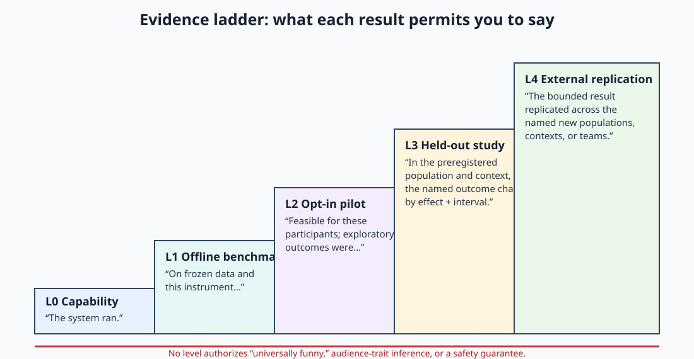

# Real-world study workbench

The repository now includes a complete, local analyzer for the highest-value next experiment: a
within-writer crossover comparing unassisted and HumorVibes-assisted material. It turns the
research roadmap into a runnable protocol while refusing to turn synthetic or underqualified data
into a product claim.

This is research infrastructure, not institutional review, legal advice, a consent platform, or
evidence that HumorVibes improves comedy.

## Question it can answer

For consenting writers and a named, held-out audience:

> Does using HumorVibes change the preregistered primary outcome relative to the writer's normal
> process, within the same writer and matched premise, by more than the smallest effect declared
> useful in advance?

The default primary outcome is a material-level audience rating. Drafting time can instead be the
primary outcome. Selection, performance, voice preservation, laughter, and harm/regret remain
secondary outcomes unless a new protocol declares one primary before collection.

## Run the complete synthetic contract

From a source checkout:

```bash
python3 -m pip install -e .
humorvibes study-demo --out jestry_out/study_demo_receipt.json
```

Or run the self-contained example directly:

```bash
python3 examples/writer_study_demo.py
```

The fixture contains 6 pseudonymous writers, 12 paired premises, 24 material records, and 192
audience ratings. It deliberately produces an apparent positive effect. The receipt still says:

```json
{
  "data_origin": "synthetic_contract_fixture",
  "evidence_level": "L1_OFFLINE_CONTRACT",
  "claim_gate": {"claim_ready": false}
}
```

That is an adversarial property: an impressive synthetic effect cannot authorize human-facing
copy.

## Create and freeze a protocol

Start with the human-observation template:

```bash
humorvibes study-protocol --human-observed --out protocol.json
```

Before collecting anything, edit and then freeze at least:

- target population and recruitment channel;
- one primary outcome;
- rating scale and minimally important difference;
- assignment seed, sample minima, exclusion rules, and stopping rule;
- whether this is an external replication;
- retention/deletion policy and consent process;
- a public or timestamped HTTPS preregistration URI.

Commit the frozen protocol or place its digest in a public registry. Do not change it after looking
at outcomes; if the plan changes, publish an amendment and label the resulting analysis
exploratory.

## Build the prospective launch pack

Before registration or recruitment, turn the edited human protocol into separated operational
artifacts:

```bash
humorvibes study-key --out restricted/randomization.key
humorvibes study-launch \
  --protocol protocol.json \
  --assignment-key-file restricted/randomization.key \
  --out-dir study_launch/writer-crossover-v1
```

The command computes a prospective writer-level precision plan, adjusts recruitment for declared
attrition, freezes the resulting minimum counts, creates balanced crossover assignments, and
uses the mode-0600 key so a public seed cannot reveal assignments, and writes separate restricted
and blinded schedules. It also writes a complete preregistration draft,
an operations runbook, and a receipt whose status remains
`READY_FOR_EXTERNAL_ETHICS_AND_REGISTRATION`.

The default assumptions are a 0.25-point target effect, 0.45 between-writer SD, 0.60 within-writer
premise SD, two paired premises per writer, two-sided alpha 0.05, power 0.80, and 15% writer
attrition. These are transparent starting assumptions, not observed variance. Review sensitivity
across plausible values and add a hierarchical simulation before institutional submission.

`restricted_assignment_map.json` contains the condition mapping and must be access-controlled.
The randomization key stays outside the launch directory; the receipt records only its SHA-256
commitment. Never commit or transmit the key with the blinded schedules.
Writers use `blinded_writing_schedule.json`; audience facilitators use
`blinded_audience_schedule.json`. Each audience panel receives only one version of a paired block.
The public analysis export must never contain the restricted mapping.

## Export only the analysis contract

The study bundle accepts two row types.

### Material record

One record identifies a version of material without containing the material itself:

```json
{
  "material_id": "material-pseudonym",
  "writer_id": "writer-pseudonym",
  "premise_id": "paired-premise-pseudonym",
  "condition": "control",
  "material_version": "v1",
  "minutes_to_draft": 41.5,
  "selected": true,
  "performed": false,
  "voice_preservation_rating": 4.0,
  "language": "en",
  "context_version": "rehearsal-v1",
  "model_config_digest": "<lowercase SHA-256>",
  "permission_confirmed": true
}
```

Each `(writer_id, premise_id)` block must have exactly one `control` and one `assisted` record.
This pairing reduces writer and premise variation without pretending that all writers respond the
same way.

### Audience response record

```json
{
  "response_id": "response-pseudonym",
  "material_id": "material-pseudonym",
  "audience_id": "audience-pseudonym",
  "venue_id": "venue-pseudonym",
  "rating": 3.5,
  "laughed": true,
  "harm_or_regret": false,
  "consent_confirmed": true,
  "held_out": true,
  "recorded_at": "2026-07-26T20:00:00Z"
}
```

Unknown fields fail closed. Raw joke text, prompts, names, email, phone, address, IP address,
demographic labels, and inferred protected traits are rejected. The API exposes the template at
`GET /v1/research/study-template`; it deliberately has no endpoint for uploading study rows.
Analysis stays local.

## Analyze

```bash
humorvibes study-analyze \
  --protocol protocol.json \
  --bundle privacy_minimized_bundle.json \
  --out analysis_receipt.json
```

The analyzer performs these operations in order:

1. rejects schema drift, raw text/identity, duplicate IDs, missing permission/consent, invalid
   scales, non-finite values, unknown material references, and incomplete condition pairs;
2. aggregates repeated audience ratings to one mean per material;
3. computes an assisted-minus-control effect within each writer-premise block;
4. averages paired effects within writer;
5. produces a percentile interval by resampling writers—not ratings—with a frozen seed;
6. reports sample units, secondary descriptives, harm/regret, every claim-gate check, and a digest.

For drafting time, positive means `control minutes - assisted minutes`; for audience rating,
positive means `assisted rating - control rating`.

## Claim gate

The analyzer marks `claim_ready: true` only when all of the following hold:

- origin is `human_observed`, never the synthetic fixture;
- the plan is preregistered with an HTTPS record;
- consent and held-out audiences are required and present;
- declared minimum counts for writers, premises, audiences, and ratings are reached;
- every writer-premise block is paired;
- the writer-clustered 95% interval's lower bound exceeds the preregistered minimally important
  difference.

This is intentionally demanding and still does not prove universal funniness. A passing receipt
permits a bounded sentence about the named primary outcome, sample, context, comparison, effect,
and interval. External replication must be a genuinely independent rerun, not a boolean changed
after the fact.



## Why the independent unit is the writer

Two hundred ratings on one joke are not two hundred independent tests of a writing tool. The tool
acts during writing; ratings are nested under material, material under premise and writer. The
analyzer therefore aggregates ratings before comparing conditions and bootstraps writers.

This is a transparent baseline, not the final word. A sufficiently large confirmatory study should
also fit a prespecified hierarchical model with crossed effects for writer, premise/material,
audience, venue, and possibly performance order. Compare that model with the receipt, publish both,
and do not switch estimators based on which one passes a threshold.

## External collection infrastructure still needed

The code intentionally does not fake the human-operations layer. Before a real pilot, a study team
still needs:

- appropriate ethics/IRB review or documented determination for its institution and jurisdiction;
- accessible consent, withdrawal, compensation, and complaint processes;
- a secure identity-to-pseudonym linkage store separate from the analysis export;
- a reviewed presentation UI around the generated blinded schedules, version-locked stimuli, and
  an audit log;
- retention/deletion automation and access control;
- delivery/context capture proportionate to the question;
- institutional review of the generated prospective precision assumptions and a hierarchical
  simulation sensitivity analysis;
- a plan for adverse outcomes and stopping the pilot.

The practical first milestone is not “prove the theory.” It is to show that independent writers
can use the protocol, that privacy-minimized exports validate, and that the outcome and grouping
structure match the decision a real user needs to make.
